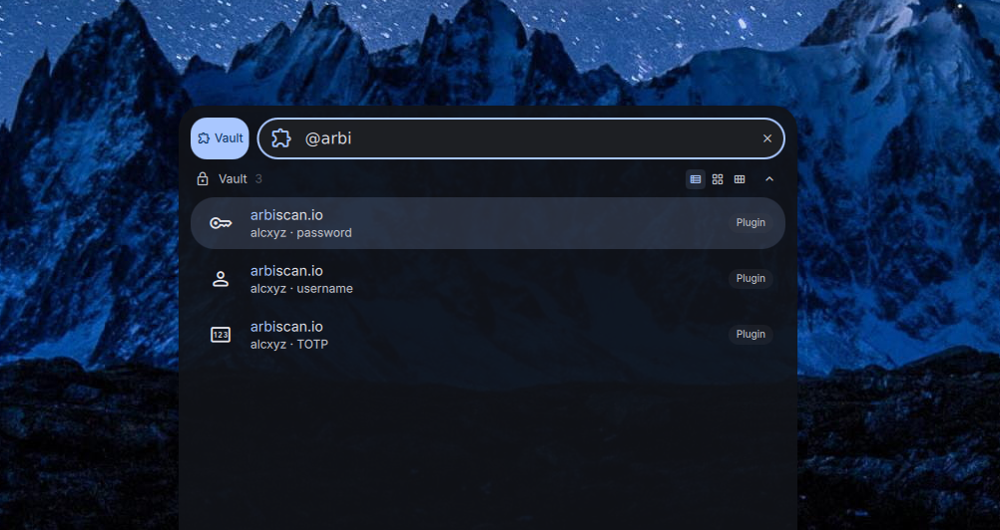

# DankVault

A launcher plugin for [DankMaterialShell](https://github.com/AvengeMedia/DankMaterialShell) that searches your password vault and copies credentials to the clipboard.



## Features

- Multi-backend: supports rbw (Bitwarden), pass, gopass, and 1Password CLI
- Auto-detects installed password manager
- Search vault entries by name, username, or folder
- Copy password, username, or TOTP code to clipboard
- Context menu for switching between credential fields
- Secure clipboard: paste-once, sensitive flag, 15s auto-clear

## Installation

### Nix (flake)

Add as a `flake = false` input and include in your DMS plugin configuration:

```nix
inputs.dms-plugin-vault = {
  url = "github:alcxyz/DankVault";
  flake = false;
};
```

```nix
programs.dank-material-shell.plugins.DankVault = {
  enable = true;
  src = inputs.dms-plugin-vault;
};
```

### Manual

Copy the plugin directory to `~/.config/DankMaterialShell/plugins/DankVault/`.

## Usage

Activate with `@` (default trigger) in the DMS launcher, then:

- `@` — list all vault entries
- `@github` — search for entries matching "github"
- Select an entry to copy the default field (password)
- Right-click for options: copy password, username, or TOTP

## Supported backends

| Backend | Package | Notes |
|---|---|---|
| [rbw](https://github.com/doy/rbw) | `rbw` | Bitwarden CLI client — must be configured and unlocked |
| [pass](https://www.passwordstore.org/) | `pass` | Standard Unix password manager — requires GPG |
| [gopass](https://github.com/gopasspw/gopass) | `gopass` | Enhanced pass-compatible password manager |
| [1Password CLI](https://developer.1password.com/docs/cli/) | `op` | 1Password CLI — must be signed in |

Auto-detection tries them in the order above and uses the first one found. Override in settings.

## Requirements

- `wl-copy` — Wayland clipboard utility (from wl-clipboard)
- At least one supported password manager backend

## License

MIT

<details>
<summary>Support</summary>

- **BTC:** `bc1pzdt3rjhnme90ev577n0cnxvlwvclf4ys84t2kfeu9rd3rqpaaafsgmxrfa`
- **ETH / ERC-20:** `0x2122c7817381B74762318b506c19600fF8B8372c`
</details>
